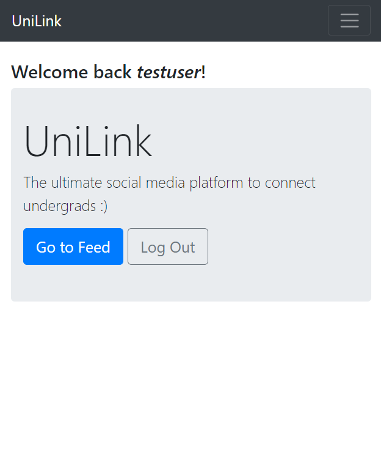

# UniLink Project

This is a social media project that is developed using Django Framework as backend. Our main goal of this project was to build a platform to connect with other university students. This has similar funcionalities like other Social Media Platforms like Facebook.

Funcionalities available so far in the site :
* User Signup
* User Login/Logout
* (Django Inbuilt user authentication)
* Password Reset ( Using Twillio as a service ) 
* News Feed similar to Facebook (not yet user oriented so far)
* Make posts and edit them
* User Authorization features
  
This is how to get started and customize it.

   
1) First, clone the repository. 

        git clone https://github.com/SasikaA073/Social-blog

2) Then run this command to activate a python environment. After that activate the environment. 

    In linux,

        virtualenv --python=python3 ~/venv/MyVirtEnv
        source ~/venv/MyVirtEnv/bin/activate

    In Windows,

        python -m venv "MyVirtEnv"
        source MyVirtEnv\Scripts\activate
            
    If your Python virtual environment works fine, then in the command line should be something similar to this.
    

        (MyVirtEnv) C:\Users\Foo

3) Now you have to install the required python libraries. Then run this command.

        pip install -r requirements.txt

4) Now the last part!
   
        python manage.py runserver

 
        
        

